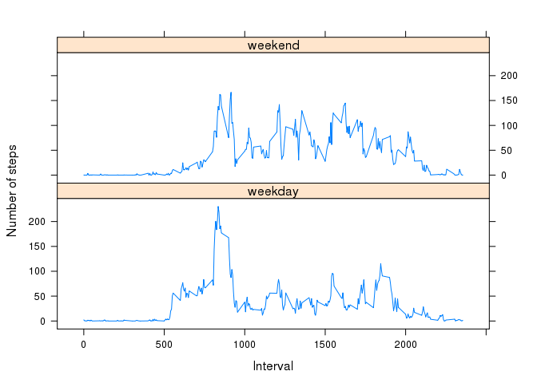

# Reproducible Research: Peer Assessment 1
Vern  
8/15/2015  

## Loading and preprocessing the data

### Loading

Download the dataset here: [Activity monitoring data](https://d396qusza40orc.cloudfront.net/repdata%2Fdata%2Factivity.zip)  

The dataset is an csv-formatted file, with data collected over the period Oct 01 thru Nov 31 2012, at 5-min intervals throughout each day.  

There are 17568 observations with three variables:  

1. **steps**: an integer vector with missing values stored as NAs

2. **date**: a character vector of dates formated as, YYYY-mm-dd

3. **interval**: a character vector of 5-min intervals over a 24 hour period  
  

We can download, unzip, and read in the file as per the R code below:   


```r
# load libraries
library(utils)      # for download.file()

## assuming the name of the needed file in the dataset is "activity.csv"

# create temp file, and download dataset to temp file (method='curl' for 'https' url)
temp <- tempfile()
URL <- "https://d396qusza40orc.cloudfront.net/repdata%2Fdata%2Factivity.zip"
download.file(URL, temp, method = 'curl')

# read in data; remove temp file
activity_data <- read.csv(unz(temp, "activity.csv"))
unlink(temp)
```

[`tempfile`](http://www.rdocumentation.org/packages/base/functions/tempfile),
[`download.file`](http://www.rdocumentation.org/packages/utils/functions/download.file), [`read.csv`](http://www.rdocumentation.org/packages/utils/functions/read.table), 
[`unlink`](http://www.rdocumentation.org/packages/base/functions/unlink)  
__________________________________________________________________________________________________________________

----------------------------------------------------------------------------------

### Data Preprocessing

Two variables will be added to the dataset:  

1. **date_times**, a datetime vector of the dates and times combined  

2. **interval_seq**: a times vector of the 5-minute intervals for a 24-hour period


```r
# load libraries
library(dplyr)      ## manipulate the data
library(lubridate)  ## for ymd_hm function
library(chron)      ## for times class 

# convert dataframe to tbl_df (dplyr)
activity_data <- tbl_df(activity_data)

# add variable 'date_times' (POSIXct class) to dataset
activity_data <- activity_data %>%
     mutate(date_times = seq(from = ymd_hm("2012.10.1 0:0", tz = "UTC"), to = ymd_hm("2012.11.30 23:55"), by = 300))

# create char vector of sequence of 5-minute intervals over a 24-hour period
interval_seq <- format(seq(c(ISOdatetime(2012,10,1,0,0,0)), by = 300, length.out = 288), "%H:%M:%S")

# add 'interval_seq' to dataset; convert from char to times vector
activity_data$interval_seq <-interval_seq
activity_data <- activity_data %>%
     mutate(interval_seq = chron(times. = interval_seq))
```

[`dplyr`](http://www.rdocumentation.org/packages/dplyr),
[`lubridate`](http://www.rdocumentation.org/packages/lubridate/functions/lubridate), [`chron`](http://www.rdocumentation.org/packages/chron/functions/chron)  

__________________________________________________________________________________________________________________

----------------------------------------------------------------------------------

## What is mean total number of steps taken per day?

We calculate the summary statistics by grouping by date.   

We use [`ggvis`](http://www.rdocumentation.org/packages/ggvis/functions/ggvis) to plot the histogram:  


```r
#load libraries
library(ggvis)

# daily totals of steps taken per day
daily_totals <- activity_data %>%
     group_by(d = cut.POSIXt(date_times, breaks = "days")) %>%
     summarise(daily_sum = sum(steps, na.rm = TRUE))

# daily mean and daily median
daily_mean <- round(mean(daily_totals$daily_sum, na.rm = TRUE))
daily_median <- median(daily_totals$daily_sum, na.rm = TRUE)

# Histogram of total number of steps taken daily
daily_totals %>%
     ggvis(~daily_sum) %>%
     layer_histograms(width=2000, fill := "blue") %>%
     add_axis("x", title = "Number of Steps") %>%
     add_axis("y", title = "Frequency")
```

<!--html_preserve--><div id="plot_id366951721-container" class="ggvis-output-container">
<div id="plot_id366951721" class="ggvis-output"></div>
<div class="plot-gear-icon">
<nav class="ggvis-control">
<a class="ggvis-dropdown-toggle" title="Controls" onclick="return false;"></a>
<ul class="ggvis-dropdown">
<li>
Renderer: 
<a id="plot_id366951721_renderer_svg" class="ggvis-renderer-button" onclick="return false;" data-plot-id="plot_id366951721" data-renderer="svg">SVG</a>
 | 
<a id="plot_id366951721_renderer_canvas" class="ggvis-renderer-button" onclick="return false;" data-plot-id="plot_id366951721" data-renderer="canvas">Canvas</a>
</li>
<li>
<a id="plot_id366951721_download" class="ggvis-download" data-plot-id="plot_id366951721">Download</a>
</li>
</ul>
</nav>
</div>
</div>
<script type="text/javascript">
var plot_id366951721_spec = {
  "data": [
    {
      "name": ".0/bin1/stack2",
      "format": {
        "type": "csv",
        "parse": {
          "xmin_": "number",
          "xmax_": "number",
          "stack_upr_": "number",
          "stack_lwr_": "number"
        }
      },
      "values": "\"xmin_\",\"xmax_\",\"stack_upr_\",\"stack_lwr_\"\n-1000,1000,10,0\n1000,3000,1,0\n3000,5000,2,0\n5000,7000,3,0\n7000,9000,7,0\n9000,11000,12,0\n11000,13000,12,0\n13000,15000,6,0\n15000,17000,5,0\n17000,19000,1,0\n19000,21000,1,0\n21000,23000,1,0"
    },
    {
      "name": "scale/x",
      "format": {
        "type": "csv",
        "parse": {
          "domain": "number"
        }
      },
      "values": "\"domain\"\n-2200\n24200"
    },
    {
      "name": "scale/y",
      "format": {
        "type": "csv",
        "parse": {
          "domain": "number"
        }
      },
      "values": "\"domain\"\n0\n12.6"
    }
  ],
  "scales": [
    {
      "name": "x",
      "domain": {
        "data": "scale/x",
        "field": "data.domain"
      },
      "zero": false,
      "nice": false,
      "clamp": false,
      "range": "width"
    },
    {
      "name": "y",
      "domain": {
        "data": "scale/y",
        "field": "data.domain"
      },
      "zero": false,
      "nice": false,
      "clamp": false,
      "range": "height"
    }
  ],
  "marks": [
    {
      "type": "rect",
      "properties": {
        "update": {
          "stroke": {
            "value": "#000000"
          },
          "fill": {
            "value": "blue"
          },
          "x": {
            "scale": "x",
            "field": "data.xmin_"
          },
          "x2": {
            "scale": "x",
            "field": "data.xmax_"
          },
          "y": {
            "scale": "y",
            "field": "data.stack_upr_"
          },
          "y2": {
            "scale": "y",
            "field": "data.stack_lwr_"
          }
        },
        "ggvis": {
          "data": {
            "value": ".0/bin1/stack2"
          }
        }
      },
      "from": {
        "data": ".0/bin1/stack2"
      }
    }
  ],
  "legends": [],
  "axes": [
    {
      "type": "x",
      "scale": "x",
      "orient": "bottom",
      "title": "Number of Steps",
      "layer": "back",
      "grid": true
    },
    {
      "type": "y",
      "scale": "y",
      "orient": "left",
      "title": "Frequency",
      "layer": "back",
      "grid": true
    }
  ],
  "padding": null,
  "ggvis_opts": {
    "keep_aspect": false,
    "resizable": true,
    "padding": {},
    "duration": 250,
    "renderer": "svg",
    "hover_duration": 0,
    "width": 672,
    "height": 480
  },
  "handlers": null
};
ggvis.getPlot("plot_id366951721").parseSpec(plot_id366951721_spec);
</script><!--/html_preserve-->


The mean of the total number of steps taken per day: **`9354`**

The median of the total number of steps taken per day: **`10395`**  

__________________________________________________________________________________________________________________

----------------------------------------------------------------------------------

## What is the average daily activity pattern?

This time we summarise by the intervals to calculate the daily activity patterns:


```r
# time series plot of the 5-minute interval vs the average number of 
# steps taken, averaged across all days (y-axis)
interval_means <- activity_data %>%
     group_by(interval) %>%
     summarise(interval_mean_steps = mean(steps, na.rm = TRUE))

interval_means %>%
     ggvis(~interval, ~interval_mean_steps) %>%
     layer_lines(stroke := "blue") %>%
     add_axis("x", title = "24-hour Time (5-Minute Intervals)", format = "d") %>%
     add_axis("y", title = "Mean Steps per Interval")
```

<!--html_preserve--><div id="plot_id165542123-container" class="ggvis-output-container">
<div id="plot_id165542123" class="ggvis-output"></div>
<div class="plot-gear-icon">
<nav class="ggvis-control">
<a class="ggvis-dropdown-toggle" title="Controls" onclick="return false;"></a>
<ul class="ggvis-dropdown">
<li>
Renderer: 
<a id="plot_id165542123_renderer_svg" class="ggvis-renderer-button" onclick="return false;" data-plot-id="plot_id165542123" data-renderer="svg">SVG</a>
 | 
<a id="plot_id165542123_renderer_canvas" class="ggvis-renderer-button" onclick="return false;" data-plot-id="plot_id165542123" data-renderer="canvas">Canvas</a>
</li>
<li>
<a id="plot_id165542123_download" class="ggvis-download" data-plot-id="plot_id165542123">Download</a>
</li>
</ul>
</nav>
</div>
</div>
<script type="text/javascript">
var plot_id165542123_spec = {
  "data": [
    {
      "name": ".0/arrange1",
      "format": {
        "type": "csv",
        "parse": {
          "interval": "number",
          "interval_mean_steps": "number"
        }
      },
      "values": "\"interval\",\"interval_mean_steps\"\n0,1.71698113207547\n5,0.339622641509434\n10,0.132075471698113\n15,0.150943396226415\n20,0.0754716981132075\n25,2.09433962264151\n30,0.528301886792453\n35,0.867924528301887\n40,0\n45,1.47169811320755\n50,0.30188679245283\n55,0.132075471698113\n100,0.320754716981132\n105,0.679245283018868\n110,0.150943396226415\n115,0.339622641509434\n120,0\n125,1.11320754716981\n130,1.83018867924528\n135,0.169811320754717\n140,0.169811320754717\n145,0.377358490566038\n150,0.264150943396226\n155,0\n200,0\n205,0\n210,1.13207547169811\n215,0\n220,0\n225,0.132075471698113\n230,0\n235,0.226415094339623\n240,0\n245,0\n250,1.54716981132075\n255,0.943396226415094\n300,0\n305,0\n310,0\n315,0\n320,0.207547169811321\n325,0.622641509433962\n330,1.62264150943396\n335,0.584905660377358\n340,0.490566037735849\n345,0.0754716981132075\n350,0\n355,0\n400,1.18867924528302\n405,0.943396226415094\n410,2.56603773584906\n415,0\n420,0.339622641509434\n425,0.358490566037736\n430,4.11320754716981\n435,0.660377358490566\n440,3.49056603773585\n445,0.830188679245283\n450,3.11320754716981\n455,1.11320754716981\n500,0\n505,1.56603773584906\n510,3\n515,2.24528301886792\n520,3.32075471698113\n525,2.9622641509434\n530,2.09433962264151\n535,6.05660377358491\n540,16.0188679245283\n545,18.3396226415094\n550,39.4528301886792\n555,44.4905660377358\n600,31.4905660377358\n605,49.2641509433962\n610,53.7735849056604\n615,63.4528301886792\n620,49.9622641509434\n625,47.0754716981132\n630,52.1509433962264\n635,39.3396226415094\n640,44.0188679245283\n645,44.1698113207547\n650,37.3584905660377\n655,49.0377358490566\n700,43.811320754717\n705,44.377358490566\n710,50.5094339622642\n715,54.5094339622642\n720,49.9245283018868\n725,50.9811320754717\n730,55.6792452830189\n735,44.3207547169811\n740,52.2641509433962\n745,69.5471698113208\n750,57.8490566037736\n755,56.1509433962264\n800,73.377358490566\n805,68.2075471698113\n810,129.433962264151\n815,157.528301886792\n820,171.150943396226\n825,155.396226415094\n830,177.301886792453\n835,206.169811320755\n840,195.924528301887\n845,179.566037735849\n850,183.396226415094\n855,167.018867924528\n900,143.452830188679\n905,124.037735849057\n910,109.11320754717\n915,108.11320754717\n920,103.716981132075\n925,95.9622641509434\n930,66.2075471698113\n935,45.2264150943396\n940,24.7924528301887\n945,38.7547169811321\n950,34.9811320754717\n955,21.0566037735849\n1000,40.5660377358491\n1005,26.9811320754717\n1010,42.4150943396226\n1015,52.6603773584906\n1020,38.9245283018868\n1025,50.7924528301887\n1030,44.2830188679245\n1035,37.4150943396226\n1040,34.6981132075472\n1045,28.3396226415094\n1050,25.0943396226415\n1055,31.9433962264151\n1100,31.3584905660377\n1105,29.6792452830189\n1110,21.3207547169811\n1115,25.5471698113208\n1120,28.377358490566\n1125,26.4716981132075\n1130,33.4339622641509\n1135,49.9811320754717\n1140,42.0377358490566\n1145,44.6037735849057\n1150,46.0377358490566\n1155,59.188679245283\n1200,63.8679245283019\n1205,87.6981132075472\n1210,94.8490566037736\n1215,92.7735849056604\n1220,63.3962264150943\n1225,50.1698113207547\n1230,54.4716981132075\n1235,32.4150943396226\n1240,26.5283018867925\n1245,37.7358490566038\n1250,45.0566037735849\n1255,67.2830188679245\n1300,42.3396226415094\n1305,39.8867924528302\n1310,43.2641509433962\n1315,40.9811320754717\n1320,46.2452830188679\n1325,56.4339622641509\n1330,42.7547169811321\n1335,25.1320754716981\n1340,39.9622641509434\n1345,53.5471698113208\n1350,47.3207547169811\n1355,60.811320754717\n1400,55.7547169811321\n1405,51.9622641509434\n1410,43.5849056603774\n1415,48.6981132075472\n1420,35.4716981132075\n1425,37.5471698113208\n1430,41.8490566037736\n1435,27.5094339622642\n1440,17.1132075471698\n1445,26.0754716981132\n1450,43.622641509434\n1455,43.7735849056604\n1500,30.0188679245283\n1505,36.0754716981132\n1510,35.4905660377358\n1515,38.8490566037736\n1520,45.9622641509434\n1525,47.7547169811321\n1530,48.1320754716981\n1535,65.3207547169811\n1540,82.9056603773585\n1545,98.6603773584906\n1550,102.11320754717\n1555,83.9622641509434\n1600,62.1320754716981\n1605,64.1320754716981\n1610,74.5471698113208\n1615,63.1698113207547\n1620,56.9056603773585\n1625,59.7735849056604\n1630,43.8679245283019\n1635,38.5660377358491\n1640,44.6603773584906\n1645,45.4528301886792\n1650,46.2075471698113\n1655,43.6792452830189\n1700,46.622641509434\n1705,56.3018867924528\n1710,50.7169811320755\n1715,61.2264150943396\n1720,72.7169811320755\n1725,78.9433962264151\n1730,68.9433962264151\n1735,59.6603773584906\n1740,75.0943396226415\n1745,56.5094339622642\n1750,34.7735849056604\n1755,37.4528301886792\n1800,40.6792452830189\n1805,58.0188679245283\n1810,74.6981132075472\n1815,85.3207547169811\n1820,59.2641509433962\n1825,67.7735849056604\n1830,77.6981132075472\n1835,74.2452830188679\n1840,85.3396226415094\n1845,99.4528301886792\n1850,86.5849056603774\n1855,85.6037735849057\n1900,84.8679245283019\n1905,77.8301886792453\n1910,58.0377358490566\n1915,53.3584905660377\n1920,36.3207547169811\n1925,20.7169811320755\n1930,27.3962264150943\n1935,40.0188679245283\n1940,30.2075471698113\n1945,25.5471698113208\n1950,45.6603773584906\n1955,33.5283018867925\n2000,19.622641509434\n2005,19.0188679245283\n2010,19.3396226415094\n2015,33.3396226415094\n2020,26.811320754717\n2025,21.1698113207547\n2030,27.3018867924528\n2035,21.3396226415094\n2040,19.5471698113208\n2045,21.3207547169811\n2050,32.3018867924528\n2055,20.1509433962264\n2100,15.9433962264151\n2105,17.2264150943396\n2110,23.4528301886792\n2115,19.2452830188679\n2120,12.4528301886792\n2125,8.0188679245283\n2130,14.6603773584906\n2135,16.3018867924528\n2140,8.67924528301887\n2145,7.79245283018868\n2150,8.13207547169811\n2155,2.62264150943396\n2200,1.45283018867925\n2205,3.67924528301887\n2210,4.81132075471698\n2215,8.50943396226415\n2220,7.07547169811321\n2225,8.69811320754717\n2230,9.75471698113208\n2235,2.20754716981132\n2240,0.320754716981132\n2245,0.113207547169811\n2250,1.60377358490566\n2255,4.60377358490566\n2300,3.30188679245283\n2305,2.84905660377358\n2310,0\n2315,0.830188679245283\n2320,0.962264150943396\n2325,1.58490566037736\n2330,2.60377358490566\n2335,4.69811320754717\n2340,3.30188679245283\n2345,0.641509433962264\n2350,0.226415094339623\n2355,1.07547169811321"
    },
    {
      "name": "scale/x",
      "format": {
        "type": "csv",
        "parse": {
          "domain": "number"
        }
      },
      "values": "\"domain\"\n-117.75\n2472.75"
    },
    {
      "name": "scale/y",
      "format": {
        "type": "csv",
        "parse": {
          "domain": "number"
        }
      },
      "values": "\"domain\"\n-10.3084905660377\n216.478301886792"
    }
  ],
  "scales": [
    {
      "name": "x",
      "domain": {
        "data": "scale/x",
        "field": "data.domain"
      },
      "zero": false,
      "nice": false,
      "clamp": false,
      "range": "width"
    },
    {
      "name": "y",
      "domain": {
        "data": "scale/y",
        "field": "data.domain"
      },
      "zero": false,
      "nice": false,
      "clamp": false,
      "range": "height"
    }
  ],
  "marks": [
    {
      "type": "line",
      "properties": {
        "update": {
          "x": {
            "scale": "x",
            "field": "data.interval"
          },
          "y": {
            "scale": "y",
            "field": "data.interval_mean_steps"
          },
          "stroke": {
            "value": "blue"
          }
        },
        "ggvis": {
          "data": {
            "value": ".0/arrange1"
          }
        }
      },
      "from": {
        "data": ".0/arrange1"
      }
    }
  ],
  "legends": [],
  "axes": [
    {
      "type": "x",
      "scale": "x",
      "orient": "bottom",
      "title": "24-hour Time (5-Minute Intervals)",
      "format": "d",
      "layer": "back",
      "grid": true
    },
    {
      "type": "y",
      "scale": "y",
      "orient": "left",
      "title": "Mean Steps per Interval",
      "layer": "back",
      "grid": true
    }
  ],
  "padding": null,
  "ggvis_opts": {
    "keep_aspect": false,
    "resizable": true,
    "padding": {},
    "duration": 250,
    "renderer": "svg",
    "hover_duration": 0,
    "width": 672,
    "height": 480
  },
  "handlers": null
};
ggvis.getPlot("plot_id165542123").parseSpec(plot_id165542123_spec);
</script><!--/html_preserve-->

```r
# 5-minute interval with maximum number of steps on average
max_steps_interval <- activity_data$interval_seq[which.max(interval_means$interval_mean_steps)]
```


The 5-minute interval with the maximum number of steps on average: **`08:35:00`**     

__________________________________________________________________________________________________________________

----------------------------------------------------------------------------------

## Imputing missing values

Given that there are missing values (recorded as NAs) in the dataset, this may introduce bias into some calculations or summaries of the data.  

* The total number of missing values (NAs) in the dataset: **`2304`**

* All missing values are recorded only in the **steps** variable.


```r
var_NAs <- sapply(activity_data, function(y) sum(length(which(is.na(y)))))

print(var_NAs)
```

```
##        steps         date     interval   date_times interval_seq 
##         2304            0            0            0            0
```


We will use the mean value for the relevant 5-minute interval to fill in the corresponding missing values.  


```r
# we replace NAs by interval mean value for the particular interval time slot
# add the interval_mean_steps to activity_data: round the value, and convert to integer
activity_data$interval_mean_steps <- as.integer(round(interval_means$interval_mean_steps))

# add variable, updated_steps
# if steps == NA, replace with relevant interval_mean_steps for the interval: 
activity_data <- activity_data %>% 
     mutate(imp_steps = ifelse(is.na(steps), interval_mean_steps, steps))
```


We create a new dataset equal to the original dataset with the NAs replaced by interval means.


```r
imp_activity_data <- activity_data %>% select(imp_steps, date_times, interval)
```


With the updated dataset, the histogram now looks like below:  


```r
# update calculations with imputed values
imp_daily_totals <- imp_activity_data %>%
     group_by(d = cut.POSIXt(date_times, breaks = "days")) %>%
     summarise(imp_daily_sum = sum(imp_steps, na.rm = TRUE))

# updated daily mean and daily median
imp_daily_mean <- round(mean(imp_daily_totals$imp_daily_sum, na.rm = TRUE))
imp_daily_median <- median(imp_daily_totals$imp_daily_sum, na.rm = TRUE)

# updated histogram of total number of steps taken daily
imp_daily_totals %>%
     ggvis(~imp_daily_sum) %>%
     layer_histograms(width=2000, fill := "blue") %>%
     add_axis("x", title = "Number of Steps (with imputed values)") %>%
     add_axis("y", title = "Frequency(with imputed values)")
```

<!--html_preserve--><div id="plot_id946977779-container" class="ggvis-output-container">
<div id="plot_id946977779" class="ggvis-output"></div>
<div class="plot-gear-icon">
<nav class="ggvis-control">
<a class="ggvis-dropdown-toggle" title="Controls" onclick="return false;"></a>
<ul class="ggvis-dropdown">
<li>
Renderer: 
<a id="plot_id946977779_renderer_svg" class="ggvis-renderer-button" onclick="return false;" data-plot-id="plot_id946977779" data-renderer="svg">SVG</a>
 | 
<a id="plot_id946977779_renderer_canvas" class="ggvis-renderer-button" onclick="return false;" data-plot-id="plot_id946977779" data-renderer="canvas">Canvas</a>
</li>
<li>
<a id="plot_id946977779_download" class="ggvis-download" data-plot-id="plot_id946977779">Download</a>
</li>
</ul>
</nav>
</div>
</div>
<script type="text/javascript">
var plot_id946977779_spec = {
  "data": [
    {
      "name": ".0/bin1/stack2",
      "format": {
        "type": "csv",
        "parse": {
          "xmin_": "number",
          "xmax_": "number",
          "stack_upr_": "number",
          "stack_lwr_": "number"
        }
      },
      "values": "\"xmin_\",\"xmax_\",\"stack_upr_\",\"stack_lwr_\"\n-1000,1000,2,0\n1000,3000,1,0\n3000,5000,2,0\n5000,7000,3,0\n7000,9000,7,0\n9000,11000,20,0\n11000,13000,12,0\n13000,15000,6,0\n15000,17000,5,0\n17000,19000,1,0\n19000,21000,1,0\n21000,23000,1,0"
    },
    {
      "name": "scale/x",
      "format": {
        "type": "csv",
        "parse": {
          "domain": "number"
        }
      },
      "values": "\"domain\"\n-2200\n24200"
    },
    {
      "name": "scale/y",
      "format": {
        "type": "csv",
        "parse": {
          "domain": "number"
        }
      },
      "values": "\"domain\"\n0\n21"
    }
  ],
  "scales": [
    {
      "name": "x",
      "domain": {
        "data": "scale/x",
        "field": "data.domain"
      },
      "zero": false,
      "nice": false,
      "clamp": false,
      "range": "width"
    },
    {
      "name": "y",
      "domain": {
        "data": "scale/y",
        "field": "data.domain"
      },
      "zero": false,
      "nice": false,
      "clamp": false,
      "range": "height"
    }
  ],
  "marks": [
    {
      "type": "rect",
      "properties": {
        "update": {
          "stroke": {
            "value": "#000000"
          },
          "fill": {
            "value": "blue"
          },
          "x": {
            "scale": "x",
            "field": "data.xmin_"
          },
          "x2": {
            "scale": "x",
            "field": "data.xmax_"
          },
          "y": {
            "scale": "y",
            "field": "data.stack_upr_"
          },
          "y2": {
            "scale": "y",
            "field": "data.stack_lwr_"
          }
        },
        "ggvis": {
          "data": {
            "value": ".0/bin1/stack2"
          }
        }
      },
      "from": {
        "data": ".0/bin1/stack2"
      }
    }
  ],
  "legends": [],
  "axes": [
    {
      "type": "x",
      "scale": "x",
      "orient": "bottom",
      "title": "Number of Steps (with imputed values)",
      "layer": "back",
      "grid": true
    },
    {
      "type": "y",
      "scale": "y",
      "orient": "left",
      "title": "Frequency(with imputed values)",
      "layer": "back",
      "grid": true
    }
  ],
  "padding": null,
  "ggvis_opts": {
    "keep_aspect": false,
    "resizable": true,
    "padding": {},
    "duration": 250,
    "renderer": "svg",
    "hover_duration": 0,
    "width": 672,
    "height": 480
  },
  "handlers": null
};
ggvis.getPlot("plot_id946977779").parseSpec(plot_id946977779_spec);
</script><!--/html_preserve-->

The mean of the total number of steps taken per day: **`10766`**

The median of the total number of steps taken per day: **`10762`**


We may note that:  

* the distribution for the updated histogram looks a little more like a normal distribution  

* the difference between the mean and median for the updated dataset is minimal 

An interesting question here would be: how do we validate the choice of the interval mean as a fill for missing values?

__________________________________________________________________________________________________________________

----------------------------------------------------------------------------------

## Are there differences in activity patterns between weekdays and weekends?

It would seem that this is the case.  From the panel plot below, we can see a difference in the activity for the weekdays against the weekends.  On average, it looks like there is a spike in activity all week long around the 08:00 to 10:00 intervals.  However, on average, weekends appear to show more activity during the normal daytime hours.   

For processing the weekday vs weekend, we use the `is.weekend` function from the `chron` library   

For the panel plot, we use the [`lattice`](http://www.rdocumentation.org/packages/lattice/functions/Lattice) library  

We will add a new factor variable, **week_days** to the updated dataset with two levels: “weekday” and “weekend,” which will indicate whether a given date is a weekday or weekend day.


```r
# load libraries
library(lattice)

# add new variables, 'week_days' and 'imp_interval_mean', to dataset
imp_activity_data <- imp_activity_data %>%
     mutate(week_days = ifelse(is.weekend(date_times), "weekend", "weekday"))

imp_activity_data$week_days <- factor(imp_activity_data$week_days)

imp_mean_steps_per_int <- imp_activity_data %>%
     group_by(interval, week_days) %>%
     summarise(imp_interval_mean = mean(imp_steps, na.rm = TRUE))

# generate panel plot
xyplot((imp_interval_mean ~ interval | week_days), 
       data = imp_mean_steps_per_int,
       type = "l",
       xlab = "Interval",
       ylab = "Number of steps",
       layout=c(1,2))
```

 

__________________________________________________________________________________________________________________

----------------------------------------------------------------------------------
